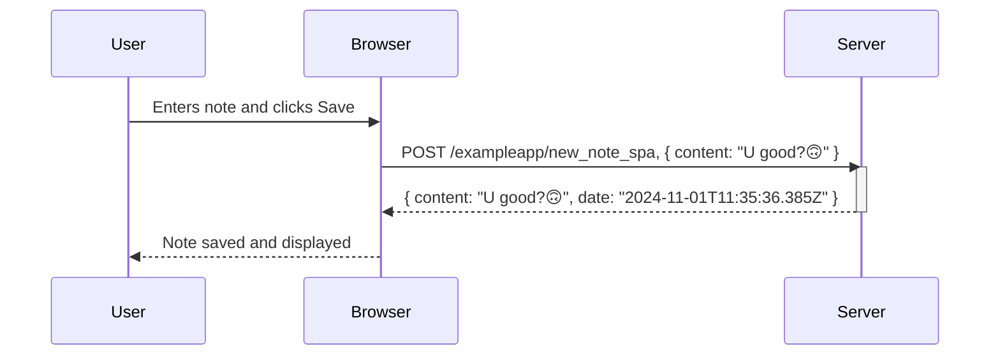

```mermaid
sequenceDiagram
    participant User
    participant Browser
    participant Server

    User->>Browser: Enters note and clicks Save
    Browser->>Server: POST /exampleapp/new_note_spa, { content: "U good?🙃" }
    activate Server
    Server-->>Browser: { content: "U good?🙃", date: "2024-11-01T11:35:36.385Z" }
    deactivate Server
    Browser-->>User: Note saved and displayed

```
