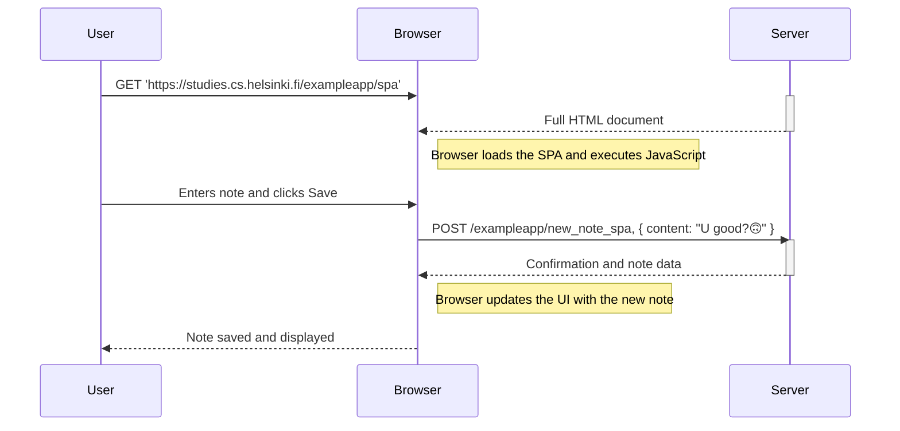

```mermaid
sequenceDiagram
    participant User
    participant Browser
    participant Server

    User->>Browser: GET 'https://studies.cs.helsinki.fi/exampleapp/spa'
    activate Server
    Server-->>Browser: Full HTML document
    deactivate Server

    Note right of Browser: Browser loads the SPA and executes JavaScript

    User->>Browser: Enters note and clicks Save
    Browser->>Server: POST /exampleapp/new_note_spa, { content: "U good?🙃" }
    activate Server
    Server-->>Browser: Confirmation and note data
    deactivate Server

    Note right of Browser: Browser updates the UI with the new note
    Browser-->>User: Note saved and displayed


```
